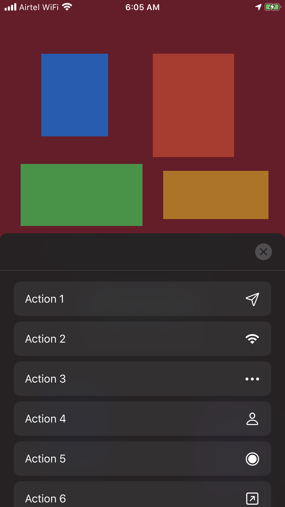
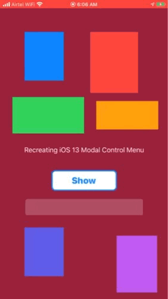

# MenuController
A great Action Menu Modal Controller inspired from iOS 13 Apple's native app implementation


[![Swift Version][swift-image]][swift-url]
[![License][license-image]][license-url]
[](http://makeapullrequest.com)


<p align="center">

</p>


## Features

* Supports Portrait and Landscape orientation
* Glossy virant menu
* Infinite Actions


## Usage

```swift
import MenuController

let actions:[UIControlMenuAction] = [
UIControlMenuAction(title: "Send Message", image: UIImage(systemName: "paperplane")!, handler: { _ in print("Sending Message") }),
UIControlMenuAction(title: "Enable Wifi", image: UIImage(systemName: "wifi")!, handler: { _ in print("Wifi ON") }),
UIControlMenuAction(title: "Delete", image: UIImage(systemName: "trash.fill")!, handler: { _ in print("Deleted ✅") })
]

let vc = MenuController(actions: actions)
present(vc, animated: true, completion: nil)
```

## Requirements

- iOS 13.0+
- Xcode 11

## Installation

### Swift Package Manager:

```swift
dependencies: [
    .package(url: "https://github.com/anmolrajpal/MenuController", from: "1.0.0")
]
```




## Meta

[@ArAnmol](https://twitter.com/ArAnmol)

[https://github.com/anmolrajpal/InteractiveModal](https://github.com/anmolrajpal/InteractiveModal)

[swift-image]:https://img.shields.io/badge/swift-5.0-orange.svg
[swift-url]: https://swift.org/
[license-image]: https://img.shields.io/badge/License-MIT-blue.svg
[license-url]: LICENSE.txt
